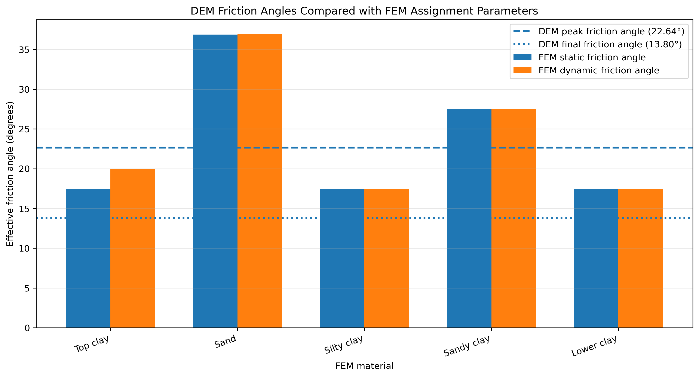
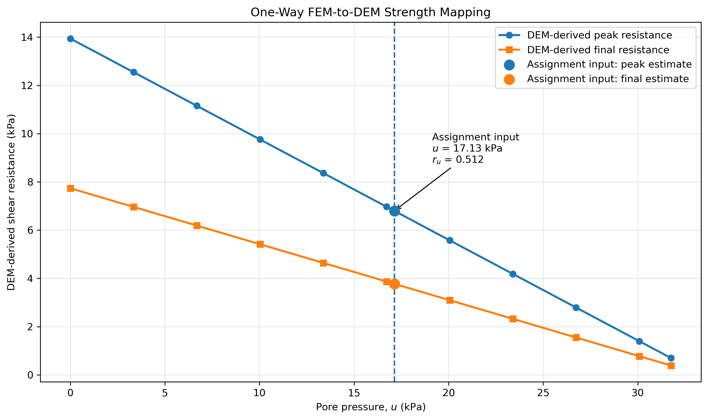
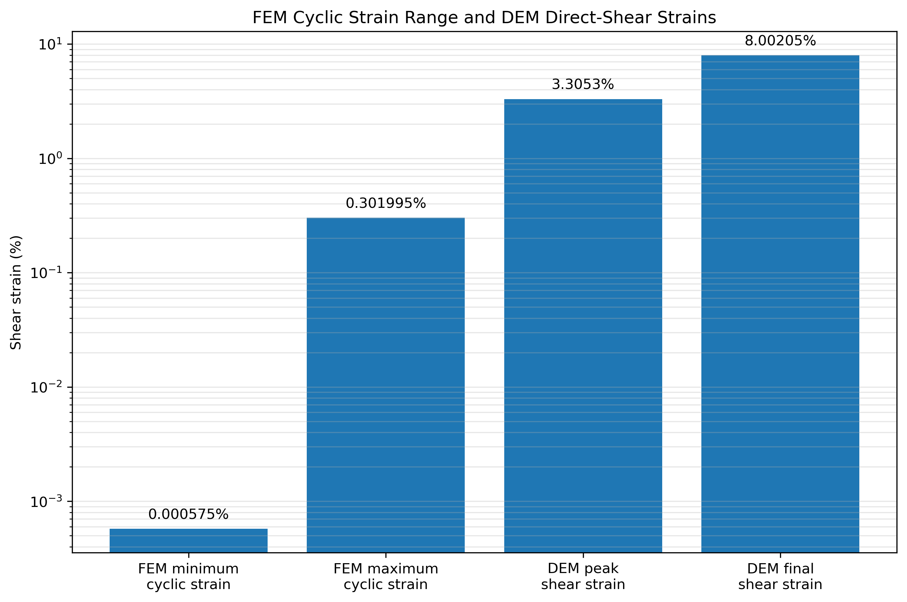

# FEM-DEM Dike Project

A foundational Python workflow demonstrating how particle-scale Discrete Element Method results can be linked to stress and pore-pressure information from a continuum Finite Element Method dike analysis.

The project includes particle-packing generation, vertical compression, numerical direct shear, pore-pressure sensitivity analysis, and a one-way FEM-to-DEM strength mapping.

## Project Objective

The purpose of this project is to demonstrate foundational understanding of:

- particle-based soil modelling;
- contact-driven stress transmission;
- numerical compression and direct shear;
- effective-stress concepts;
- pore-pressure-induced strength reduction;
- one-way transfer of FEM stress information to a DEM-derived resistance response.

This project is a controlled numerical demonstration. It is not presented as a fully coupled FEM-DEM model or a complete validation of a dike-scale failure mechanism.

## Workflow

The notebooks should be run in numerical order:

```text
01_generate_dem_packing.ipynb
        ↓
02_dem_compression.ipynb
        ↓
03_dem_shear.ipynb
        ↓
04_pore_pressure_sensitivity.ipynb
        ↓
05_fem_dem_link.ipynb
````

## Notebook 01: DEM Packing Generation

This notebook:

* generates 120 circular particles;
* applies gravity settling;
* checks particle overlap, velocity, kinetic energy, and equilibrium;
* saves the settled particle configuration.

The accepted settled packing is saved for use in Notebook 02.

## Notebook 02: DEM Compression

This notebook:

* loads the settled particle packing;
* compresses the specimen vertically;
* reaches approximately 40 kPa vertical stress;
* checks stress, strain, coordination number, kinetic energy, velocity, and particle overlap;
* saves the compressed particle configuration for the shear test.

The compressed packing is saved as:

```text
results/restart/compressed_particle_packing.npz
```

## Notebook 03: DEM Direct Shear

This notebook:

* loads the vertically compressed DEM packing;
* keeps the specimen height regulated through PI control;
* moves the top wall horizontally;
* applies displacement-controlled direct shear;
* calculates shear strain and shear stress;
* records particle contacts and sliding contacts;
* evaluates friction mobilisation;
* monitors kinetic energy;
* saves the final sheared packing.

Key results:

| Quantity               |      Result |
| ---------------------- | ----------: |
| Target vertical stress | 33.4271 kPa |
| Peak shear stress      | 13.9385 kPa |
| Final shear stress     |  7.7342 kPa |
| Peak shear strain      |    0.033053 |
| Final shear strain     |    0.080020 |
| Peak stress ratio      |    0.415233 |
| Final stress ratio     |    0.245689 |

Overall result: **SHEAR RUN ACCEPTED**

The main result file is saved as:

```text
results/shear/dem_shear_results.npz
```

The final particle state is saved as:

```text
results/restart/sheared_particle_packing.npz
```

## Notebook 04: Pore-Pressure Sensitivity

This notebook evaluates how increasing pore pressure reduces effective stress and DEM-informed shear resistance.

The effective vertical stress is calculated as:

$$
\sigma'_v = \sigma_v - u
$$

The pore-pressure ratio is defined as:

$$
r_u = \frac{u}{\sigma_v}
$$

The peak and final DEM shear resistances are scaled with effective stress under the assumptions of zero effective cohesion and linear effective-stress dependence.

Key results:

| Quantity                         |       Result |
| -------------------------------- | -----------: |
| Reference total vertical stress  |  33.4271 kPa |
| Reference peak shear resistance  |  13.9385 kPa |
| Reference final shear resistance |   7.7342 kPa |
| Peak friction angle              |      22.635° |
| Final friction angle             |      13.804° |
| Pore-pressure-ratio range        | 0.00 to 0.95 |
| Acceptance checks                | 13/13 passed |

The main result file is saved as:

```text
results/pore_pressure/pore_pressure_sensitivity_results.npz
```

## Notebook 05: FEM-to-DEM Link

This notebook compares stress and pore-pressure information from a PLAXIS dike assignment with the DEM-derived shear response.

The comparison is classified as:

> Partial consistency check with a one-way FEM-to-DEM demonstration.

The FEM and DEM models represent different spatial scales and serve different purposes.

The FEM model represents the complete dike and foundation as continuous soil domains. Its geometry is therefore defined by the dike profile, soil layers, groundwater conditions, loading stages, and boundary conditions.

The DEM model represents a small particle assembly used to study the relationship between effective stress and shear resistance. Its rectangular geometry was selected to provide a controlled numerical direct-shear specimen rather than to reproduce the complete dike.

Using identical geometry would require a dike-scale particle model with substantially more particles, calibrated grading, multiple materials, hydraulic coupling, and equivalent construction and loading stages. That is outside the scope of this foundational project.

Therefore, the comparison is not a direct geometry-to-geometry validation. It is a one-way multiscale link in which stress and pore-pressure information obtained from the FEM model are interpreted using the effective-stress-dependent resistance measured in the DEM specimen.

Mapped results:

| Quantity                            |       Result |
| ----------------------------------- | -----------: |
| FEM excess pore pressure            |    17.13 kPa |
| DEM reference total vertical stress |  33.4271 kPa |
| Mapped pore-pressure ratio          |     0.512458 |
| Mapped effective stress             |  16.2971 kPa |
| DEM-informed peak resistance        |   6.7956 kPa |
| DEM-informed final resistance       |   3.7707 kPa |
| Acceptance checks                   | 35/35 passed |

Overall result: **NOTEBOOK 05 ACCEPTED AND SAVED**

The main Notebook 05 outputs are:

```text
results/fem_dem/fem_dem_link_results.npz
results/fem_dem/fem_dem_comparison.csv
results/fem_dem/fem_dem_strength_mapping.csv
results/fem_dem/notebook_05_acceptance_checks.csv
```

## Selected Results

### FEM and DEM Friction-Angle Comparison



### FEM-to-DEM Strength Mapping



### Strain-Range Comparison



## Repository Structure

```text
fem-dem-dike-project/
├── README.md
├── requirements.txt
├── LICENSE
├── .gitignore
│
├── notebooks/
│   ├── README.md
│   ├── 01_generate_dem_packing.ipynb
│   ├── 02_dem_compression.ipynb
│   ├── 03_dem_shear.ipynb
│   ├── 04_pore_pressure_sensitivity.ipynb
│   └── 05_fem_dem_link.ipynb
│
└── results/
    ├── README.md
    ├── shear/
    │   ├── README.md
    │   └── dem_shear_results.npz
    │
    ├── pore_pressure/
    │   ├── README.md
    │   └── pore_pressure_sensitivity_results.npz
    │
    ├── fem_dem/
    │   ├── README.md
    │   ├── fem_dem_link_results.npz
    │   ├── fem_dem_comparison.csv
    │   ├── fem_dem_strength_mapping.csv
    │   ├── notebook_05_acceptance_checks.csv
    │   ├── 01_friction_angle_comparison.png
    │   ├── 02_fem_dem_strength_mapping.png
    │   └── 03_strain_range_comparison.png
    │
    └── restart/
        ├── README.md
        ├── settled_particle_packing.npz
        ├── compressed_particle_packing.npz
        └── sheared_particle_packing.npz
```

## Installation

Install the required Python packages using:

```bash
pip install -r requirements.txt
```

The main dependencies are:

```text
numpy
pandas
matplotlib
jupyter
```

## Running the Project

1. Download or clone the repository.
2. Install the packages listed in `requirements.txt`.
3. Open Jupyter Notebook or JupyterLab.
4. Run the notebooks in numerical order.
5. Keep the repository folder structure unchanged so that the relative file paths remain valid.

## Modelling Assumptions

The project uses:

* two-dimensional circular particles;
* 120 particles;
* a simplified particle-size distribution;
* a basic contact-force formulation;
* gravity settling;
* displacement-controlled compression and shear;
* PI-controlled vertical stress during shearing;
* zero effective cohesion;
* linear scaling of shear resistance with effective stress;
* one-way FEM-to-DEM information transfer.

## Limitations

This project does not include:

* a dike-scale DEM geometry;
* a fully coupled FEM-DEM simulation;
* direct fluid flow through the DEM particle assembly;
* two-way stress or displacement transfer;
* particle-scale hydraulic coupling;
* detailed soil-grading calibration;
* laboratory calibration of the DEM contact parameters;
* identical FEM and DEM materials;
* identical FEM and DEM loading paths;
* identical FEM and DEM boundary conditions;
* full validation of the PLAXIS dike model.

The original PLAXIS assignment is not included in this repository. Only processed values and derived comparison results are presented.

## Interpretation

The project demonstrates how pore-pressure information obtained from a continuum model can be translated into an effective-stress condition and interpreted using a particle-scale shear response.

The results show the expected reduction in effective stress and mobilised shear resistance as pore pressure increases.

Because the FEM and DEM models differ in geometry, material representation, scale, loading path, and boundary conditions, the final comparison should be interpreted as a foundational multiscale demonstration rather than a predictive dike-failure model or a fully coupled FEM-DEM validation.

## Author

Duaa Siddiqui

Geotechnical engineering and computational modelling portfolio project.

```
```
